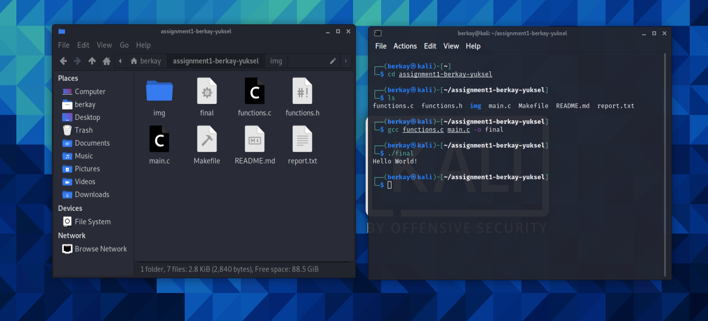

# CEN354 Operating Systems - Assignment  #1
---
**2017556070**

**Berkay Yüksel**

**Answers**
---
I'm going to use kali linux with oracle vm virtualbox cause they are popular. So if I had any problem I can find a solution easily.

Git is distributed version control software. Developers can clone the repo and make changes. After that they can push to the main repo and only different files or part of the code will change. At the same time git will be recorded what was happen.

https://youtu.be/V_Payl5FlgQ
this video helped me installing linux,https://youtu.be/O5mG8H36V44 this video helped me about makefile

I don't face any problem for this assigment

